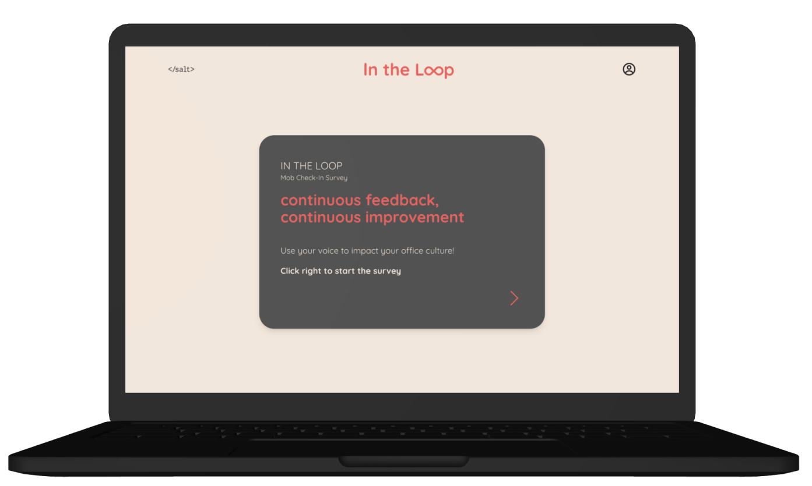

# This is IN THE LOOP

## A survey application created for continuous feedback and instant result

An app that answers the challenge of building and maintaining a positive office culture. Employers often struggle to get honest feedback from their employees, leading to disengagement, low morale and eventually more people quitting. In the Loop transforms employee feedback into actionable insights.
By collecting real-time data from surveys we generate dynamic graphs, gauges and also give suggestions for improvements. This allows for: quick assessment of the organizational health, helps with monitoring of important key factors, continuous improvements over time.For employees, it offers an engaging way to voice their opinions and see the improved changes.

### The Team

| [](https://github.com/r0binsahin) | [](https://github.com/magdalena-karpinska) | [](https://github.com/JonathanZeray) | [](https://github.com/iiiamken) |
|:---:|:---:|:---:|:---:|
| **Robin Sahin**   | **Magdalena Karpinska** | **Jonathan Zeray** | **Kenny Dinh**  |

### TRY IT HERE

[in-the-loop.vercel.app](https://in-the-loop.vercel.app/surveys/1)

## TECH STACK


## TABLES


## Application flow



### Description for Image 1


### The application is created fully responsive


### Description for Image 3


### Description for Image 4


### img5


### img6


### As admin you can see all surveys, add new survey and handle themddd


### You can edit a survey by adding or deleting a question


### As admin you can also see results for each survey. The difference from the user result is this get advice button. If the average rating of a question is below 6 then this button appears here to take you to advice page


### Let see how we can improve the communication in the team


### This openAI support is based on scientific researches and proven experience, so the user can be sure that the method suggested are reliable. For each suggestion there is a reasoning, action to apply and the resources

## Getting Started

First, run the development server:

```bash
npm run dev
# or
yarn dev
# or
pnpm dev
# or
bun dev
```

Open [http://localhost:3000](http://localhost:3000) with your browser to see the result.

You can start editing the page by modifying `app/page.tsx`. The page auto-updates as you edit the file.